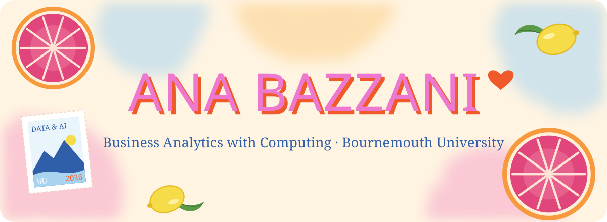
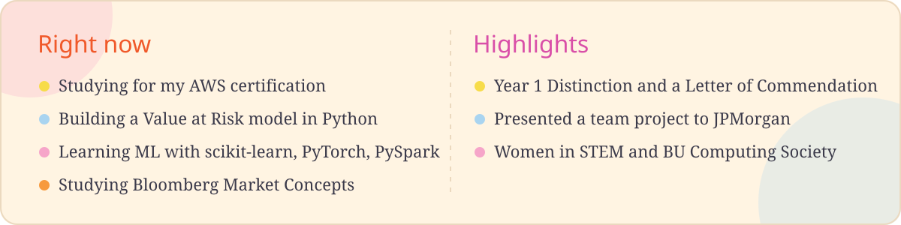
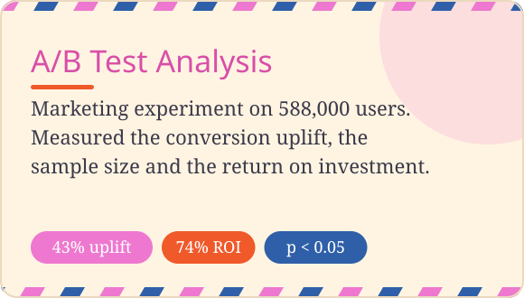
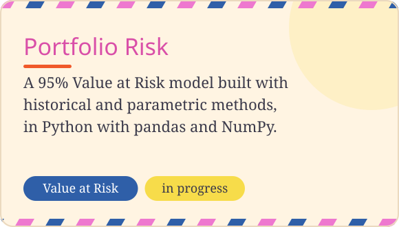
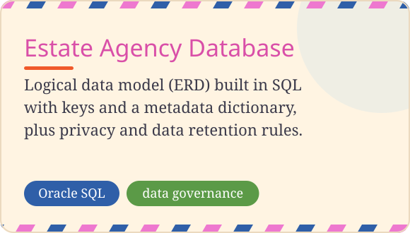
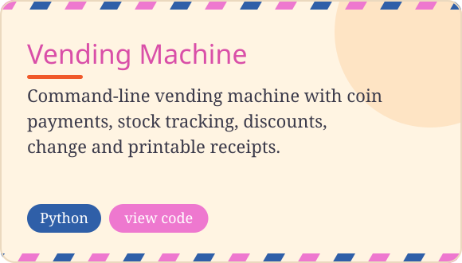
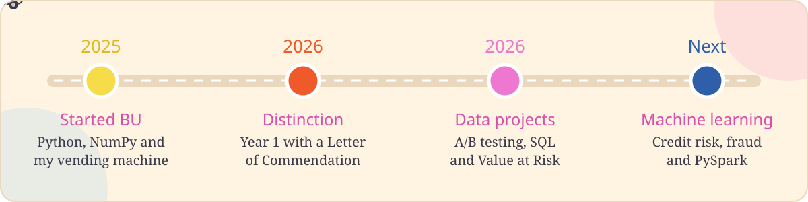

Hi everyone!! I am currently a 2nd year Business Analytics with Computing student at BU. 
Check out what I made so far and please feel free to drop any tips :))

  

<b>Coming next:</b> credit risk model, fraud detection classifier and a PySpark data pipeline

 

 

 

 

